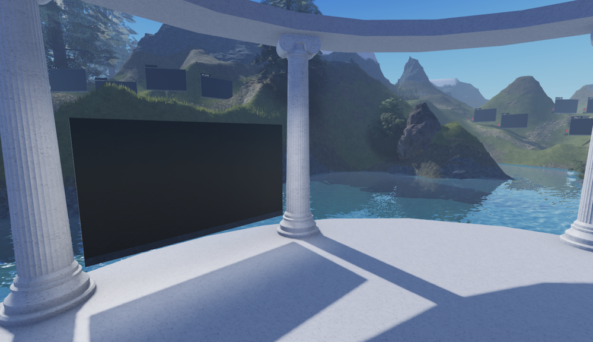

# Loci

A [locus](https://en.wikipedia.org/wiki/Method_of_loci) is a place for intellectual activity, organised around talking boards on a particular topic and scheduled office hours where the host is available for discussion. It is recommended that you use a tablet and stylus (e.g. an Apple iPad and Pencil). To join a locus you'll need Roblox and Discord, see the [instructions](https://metauni.org/posts/instructions/instructions). 

Talking boards follow an indexing convention similar to paragraphs in a text: **LCXYZ.xyz:abc** stands for locus **XYZ**, board group **xyz** and board number **abc** within that group. To view a talking board, the best idea is to either click on it or go into "first person" mode by either using the scrollwheel on your mouse, the I/O keys on your keyboard, or pinching to zoom in.

## LC001 - Matrix factorisations

* **Links**: [Roblox](https://www.roblox.com/games/6461013759/metauni-LC001), [Discord](https://discord.gg/9yBaAxPSK8) voice channel `LC001`.
* **Next office hours**: `TBA`

### LC001.01 - General introduction

* **Video**: [YouTube](https://youtu.be/39d4g1ERDpw).
* D. Eisenbud, "[Homological algebra on a complete intersection, with an application to group representations](https://www.ams.org/journals/tran/1980-260-01/S0002-9947-1980-0570778-7/home.html)", Trans. Amer. Math. Soc. **260** (1980), 35--64.
* P. Dirac "[The quantum theory of the electron](https://royalsocietypublishing.org/doi/10.1098/rspa.1928.0023)", Proc. R. Soc. Lond. A117 (1928) 610--624.
* M. Khovanov and L. Rozansky, "[Matrix factorizations and link homology](https://arxiv.org/abs/math/0401268)", Fund. Math. 199 (2008), 1--91.

### LC001.02 - Exterior algebras

* **Video**: [YouTube](https://youtu.be/D_LoTZ8OYsc).
* The main reference is my notes on [Tensor, Exterior, Symmetric algebras](http://therisingsea.org/notes/TensorExteriorSymmetric.pdf).
* If you want to know more about universal properties, functors and categories you could see [my old course](http://therisingsea.org/post/mast90068/) but there are many fine references for category theory (my usual reference is Borceux's "Handbook of categorical algebra").

### LC001.03 - Clifford algebras

* **Video**: [YouTube](https://youtu.be/ipqKvNHnABs).
* Beyond the [Wikipedia entry](https://en.wikipedia.org/wiki/Clifford_algebra) the main reference for Clifford algebras is T. Friedrich "Dirac operators in Riemannian geometry", Graduate Studies in Mathematics Vol. 25, AMS.
* For the relation between Clifford algebras and matrix factorisations see R.-O. Buchweitz, D. Eisenbud, J. Herzog "Cohen-Macaulay modules on quadrics".
* For the identity defect see N. Carqueville, D. Murfet "[Adjoints and Defects in Landau-Ginzburg models](https://arxiv.org/abs/1208.1481)", Advances in Mathematics, 2016. 
* Notes from two of my talks on the relation between Clifford algebras and matrix factorisations "[Monoidal bicategories of critical points](http://therisingsea.org/notes/talk-symbicatlg.pdf)" (2019) and "[From critical points to extended TQFTs](http://therisingsea.org/notes/talk-monash-2020.pdf)" (2020).

### LC001.04 - Exterior algebra as a Hilbert space

* **Video**: [YouTube](https://youtu.be/_emHNcPRJFU).
* For the pairing on the exterior algebra see [TES](http://therisingsea.org/notes/TensorExteriorSymmetric.pdf).
* See the [postulates of quantum mechanics](https://en.wikipedia.org/wiki/Mathematical_formulation_of_quantum_mechanics). Another physics reference I recommend is A. L. Fetter and J. D. Walecka "Quantum theory of many-particle systems", McGraw-Hill.
* See Wikipedia for the basics on [fermionic Fock states](https://en.wikipedia.org/wiki/Fock_state).

### LC001.05 - Entanglement

* **Video**: [YouTube](https://youtu.be/DZdk5yTl5Eg).
* The standard survey reference for entanglement is R. Horodecki, P. Horodecki, M. Horodecki, K. Horodecki, "[Quantum entanglement](https://arxiv.org/abs/quant-ph/0702225)". 
* I also recommend the textbook M. A. Nielsen and I. L. Chuang, "[Quantum Computation and Quantum Information](https://www.amazon.com.au/Quantum-Computation-Information-10th-Anniversary/dp/1107002176)"
10th Anniversary Edition (available freely online [PDF](http://mmrc.amss.cas.cn/tlb/201702/W020170224608149940643.pdf)).
* See also [Preskill's notes](http://theory.caltech.edu/~preskill/ph219/index.html#lecture) specifically [Preskill Ch.4](http://theory.caltech.edu/~preskill/ph229/notes/chap4_01.pdf) and [Preskill Ch.7](http://theory.caltech.edu/~preskill/ph229/notes/chap7.pdf).

## LC002 - Research Agora

* **Links**: [Roblox](https://www.roblox.com/games/7168699181/metauni-LC002-Research-Agora), [Discord](https://discord.gg/9yBaAxPSK8) voice channel `LC002`.
* **Next office hours**: `TBA`

A place for graduate students to share and discuss their mathematical preoccupations. To record a talking board you will need to record audio locally on your computer and send it to me, synchronised with a recording of you writing on one of the boards in `LC002`. To record on the board, follow the instructions below in HOWTO, using as "Replay Name" your real name or username followed by some number (e.g. `dan.01`). Send me the audio file (MP3 or MP4) and name of your recording by email and I'll do the rest. At the moment **there is no erase**, use Undo instead.

# HOWTO

## How to make a recording

Here is how the talking boards are created.

* In Roblox Studio, insert a whiteboard with the replay functionality. Make sure that under `Settings > Security` you enable Studio Access to API Services, because the recording is stored to a DataStore (the Studio and live versions will connect to the same DataStore). Publish the Roblox game, make it public and join the live version on your iPad.
* Open up the whiteboard on your iPad and enter the "Record" menu. When you're ready to start recording tap "Start Record" on your iPad, and also start recording audio on your computer (I use Camtasia, but your favourite audio recording software will do). Generally I  When you're finished open the Record menu again and click "Stop Record" and stop recording the audio. Keep in mind that Roblox will only allow you to upload audio segments of seven minutes or less (I try to keep it under 5 minutes to be safe, large files are also rejected).
* Choose a name for the recording and enter it in the "Replay Name" field and click "Save Replay". This name is used as a key into the DataStore. I generally follow the above naming convention **LCXYZ.xyz:abc** for each board.
* Make sure your recording is in MP3 format (I use MP3 encoder, available on the Mac Appstore). Then upload it to Roblox (this costs Robux) and grab the ID. If you have problems uploading the file, try compressing it with [this](https://www.onlineconverter.com/compress-mp3).
* Stop Roblox Studio and edit the whiteboard, under `Config > Sound` and set `SoundId` to the ID of the uploaded audio. Set `Config > SpielName` to whatever you named the recording.

Note that as currently implemented, if there is a "next board" it will start playing as soon as the recorded strokes end, so make sure you write something on the board just before you stop recording and stop the audio (I usually remember this by writing the board number). Also note that each time you click "Start Record" the replay history is wiped, so "Stop Recording" is **not** a pause in the recording.
