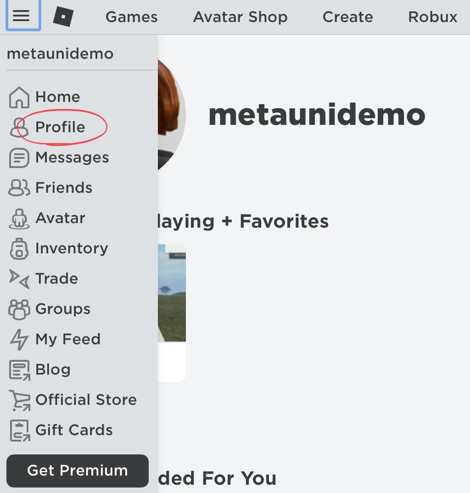
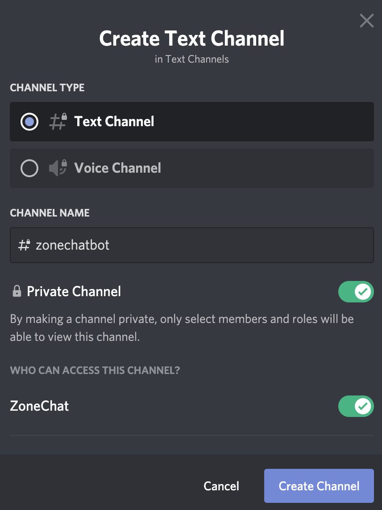
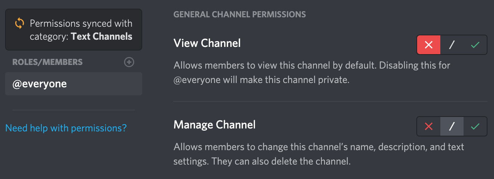
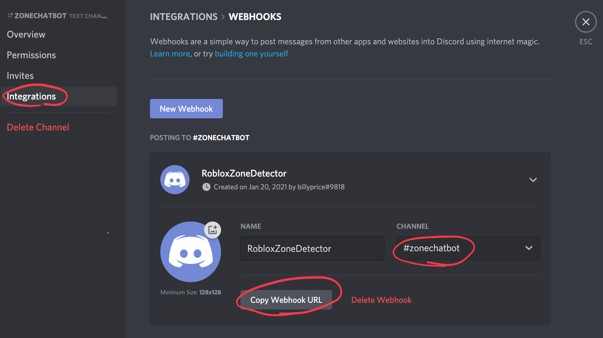
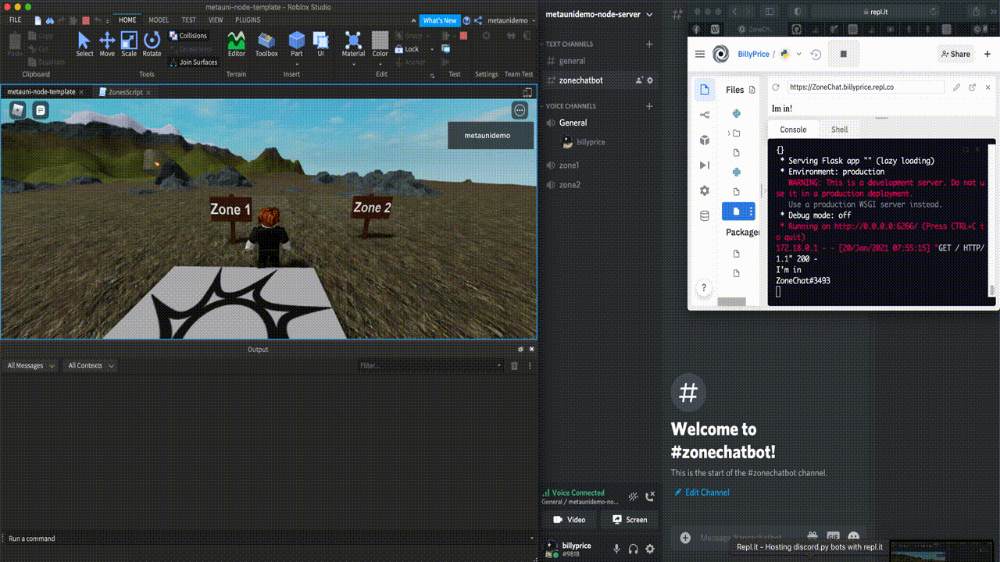

# How To Create Your Own metauni Node

Creating a metauni node is easy and requires no coding experience (although there are a few steps at the moment). It can be done using freely available tools. Before you post content to your node, please [review the rules](http://metauni.org/posts/rules/rules) surrounding Roblox.

## Accounts
You will need to create the following accounts. Roblox and Discord are mandatory for compatibility - but MongoDB and repl.it may be substituted for your preferred database and persistent server.
- [Roblox](https://www.roblox.com)
- [Discord](https://discord.com/) - for joining and hosting voice channels
- [MongoDB](https://www.mongodb.com) - stores Roblox and discord accounts for each user
- [repl.it](https://repl.it) - controls the discord bot and mongoDB for voice channels
  - [uptimerobot](https://uptimerobot.com) - pings the repl.it to keep it alive.

**Recommended**: _Open up a notepad or textedit document to copy things down as we go_

## Roblox Studio
1. **Download Roblox** by clicking play on any Roblox game ([here's the metauni one](https://www.roblox.com/games/6233302798/Metauni)) and **Roblox Studio** via the `Start Creating` button at [roblox.com/create](https://www.roblox.com/create).
  - Mac - Run the `.dmg` file and drag Roblox to `Applications`. It will install Roblox Studio when you open it.
  - Windows - ??
(You may see this error when joining a Roblox game. Just click retry until it works)

2. **Open the [metauni-node-template](Backup18-1-2021.rbxl) in Roblox Studio** (double-click the `.rbxl` file).

### metauni-node-template contents

- Workspace -> **Spawn Location**: where players spawn into your place (move this down into the ground to make it invisible
- Workspace -> **Zones**: translucent zones which will correspond to voice channels within your discord channel
  - Each zone in this folder is a `Model` with a primary `Part` (the physical object), with `Transparency: 0.9` and `CanCollide` disabled so players can see and walk through it.
- Workspace -> metauniPortal: teleports players to the metauni hub.
  - This can be customised to teleport to any other place (i.e. another metauni node).
  - To make a portal to, for example, [The Rising Sea](https://www.roblox.com/games/6224932973/The-Rising-Sea), duplicate the portal and take the placeID `6224932973` from the game url https://www.roblox.com/games/6224932973/The-Rising-Sea. Then double-click the `teleportScript` inside your new portal and modify the place ID in the line `local placeID_1 = 6233302798`.
  - If you'd like your node to be accessible from the metauni hub, send your place ID to <admin@metauni.org>. 
- ServerScriptService -> **ZonesScript**: tells the discord bot which voice channel to move each player into, according to the current zone they are touching

3. **Publish your node**
Go to `File -> Game Settings` and click `Publish` when prompted. Name and describe your place as you please, ideally similar to your upcoming discord server. Then click `Publish` again.

4. **Allow HTTP Requests**
Go to `File -> Game Settings` and enable `Allow HTTP Requests`, then click `Save` (navigating to another menu discards this change). This is needed for the ZonesScript to communicate with the discord bot.

5. **Make your node public**
Go to `File -> Game Settings -> Permissions` and set it to public. Save your changes.
You can then find your node through your profile on [Roblox](https://www.roblox.com). Navigate to your profile, either by clicking your avatar on the home page or using the menu at the top left of any page

Then go to **creations** to find your published game. You will already have a default place called `<User>'s Place`, so click the grid view button to see the one you've just published.

Great, you are ready to design, test and share your metauni node! You don't actually have to publish your game to test it out - you can do this locally within the RobloxStudio.

## Creating your Discord server

6. **Download the [Discord](https://discord.com/) desktop app** if you haven't already, and create a new server with the (+) button.

Fill in the details to your discretion, but choose a name similar or identical to the place you published on Roblox.

7. **Create the ZoneChat discord bot**
Go to the Applications tab of the [Discord Developer Portal](https://discord.com/developers/applications). Select `New Application` in the top left and name your bot, we'll call ours `ZoneChat`. Then go to the `Bot` tab and add a bot to your app. This new bot has a token/secret, which you should now copy and save for later use. 

8. **Add the bot to your discord server**
Go to the `Oauth2 Generator` under the `Oauth2` tab of your `ZoneChat` app. Under `scope` select `bot`, and then enable the permission `Send Messages`, `Read Message History` and `Move Members`. Then go to the generated Oauth2 URL and add the bot to your server. 
If successful, you should see your discord server has a new member. 

9. **Add a private channel to your server for the zone-chat bot**
Click the (+) to create a text channel under `TEXT CHANNELS`, and name it (we called this one `zonechatbot`). Make it a private channel and allow the bot to access it if you have the option.

- If you don't have the private channel option or can't add the bot, click the edit channel gear and go to the `Permissions` tab. With the `@everyone` role selected, make sure `View Channel` is disabled.

Now click the (+) next to `ROLES/MEMBERS` and add the **role** of your bot, then allow it to `View Channel`.

You'll want to disable notifications from this channel (you'll get a notification every time someone enters a zone), by right-clicking the channel and setting notifications to `Nothing`.

10. **Create a webhook for your channel**
The webhook will allow our Roblox world to send move commands to this channel (which the bot will read and react to). In the `Edit Channel` page for your private channel, go to the `Integrations` tab. Then create a new webhook.

Name it whatever and assign it to the text channel you made for it. Now we need to give the webhook URL to Roblox, so copy it. Go back to RobloxStudio and open up the script at `Explorer -> ServerScriptService -> ZonesScript`. Find the variable `WebHookURL` (should be the first line), paste in the URL you copied, then save and publish your game.

12. **Create voice channels for each zone**
For each zone in your Roblox world, you need a corresponding voice channel in your discord server. The default zones in the provided Roblox template are called `zone1` and `zone2`. Be sure to keep these channel names up to date with your Roblox world.

13. **Copy your Discord Author ID**
Go back to the discord desktop app to grab your author ID. You'll need to first enable developer mode under `Preferences -> Appearance`. 
Then open up the member list in your discord server (top right), right click on your profile and choose `Copy ID`. Save this alongside your discord bot token. 

## Setting up a Database on MongoDB
Before we make the discord bot on repl.it, we need to store the roblox and discord usernames in a database.

14. **Choose "Try Free" on [MongoDB](https://www.mongodb.com/) and make a free acount**
We'll choose the `Cloud` hosting for this guide (which is your one free instance), but you can migrate later to `On-Premises` if you prefer (not yet tested). Enter your details.

15. **Create a free, shared cluster**
Under the `Atlas` tab, make a new cluster, and choose the free - `Shared Clusters` option.

The default settings are fine. We'll host ours in Sydney. Note that the cluster name `Cluster0` is **not** the database name that we'll use later.

16. **Create a Database and Collection**
Click `Collections` on your new cluster and click `Add My Own Data` to make a new blank database and collection. We'll call them the same name, `discordroblox`, and copy this down with our other details.

17. **Configure cluster connection**
Now go to `Clusters -> Connect`, and choose `Allow Access From Anywhere` (this will allow connections from any IP address, as long as they have the username and password to access). <!-- The first step will be to whitelist an IP address. We don't know our repl.it bot's IP yet, so we'll skip this step for now. -->
Setup the first user `admin` with a secure password. Copy and save this password along side the discord details. This will be the `DATABASE_PASSWORD` that we'll give to our repl.it bot later (not your MongoDB account password).

Proceed to `Choose connection method` (bottom right) and pick `Connect your application`. We'll be using Python 3.8.2 in repl.it. Copy down the URL it gives you for use in the next step.

## repl.it - Making and Hosting the bot backend

18. **Fork the ZoneChat repl.it**
Go to [repl.it/@BillyPrice/ZoneChat-template](https://repl.it/@BillyPrice/ZoneChat-template) and click `Fork` at the very top. Rename it and make it private if you want.

19. **Place the MongoDB cluster connection URL**
Navigate to `main.py`. Look where the `cluster` variable is assigned (lines 22-24 as of writing). You need to modify the URL to match the one you copied from MongoDB. This should just mean just replacing the section after `@` symbol - be sure to leave the `DATABASE_PASSWORD` retrieval as is.

20. **Open the `.env` file and fill in the details**
This is where to dump all the things we've copied down. You can see where these are used by searching for each variable in `main.py`.

- `DISCORD_BOT_SECRET` - the token copied from the discord bot tab of your Discord Developer Application (`ZoneChat`)
- `DISCORD_AUTHOR_ID` - the discord ID of _your_ account (about 18 digits)
- `DATABASE_NAME` - the name of the MongoDB database
- `COLLECTION_NAME` - the name of the collection within that database
- `DATABASE_PASSWORD` - the password for the `admin` account to access the MongoDB database

Here's a fake example.

21. **Run your repl.it**
Click the green `Run` button at the top of the page and pray everything works. It should install various package dependencies before printing "I'm in!". The console below will print diagnostic information later - so pay attention to it if you are having problems.

You will need the repl.co URL that appears above the console for the next steps.

<!-- 20. **Configure network access from repl.it to your MongoDB cluster**
We need to allow our repl.it bot to access the database from the ip address that it's hosted on. We can find our bot's IP by going to [whatsmydns.net](https://www.whatsmydns.net/) and searching the A record of the repl.co URL from the last step. Now we can whitelist it under the network access tab of the MongoDB cluster.
 -->

22. **Set up UptimeRobot**
Now follow step 4 of [this guide from repl.it](https://repl.it/talk/learn/Hosting-discordpy-bots-with-replit/11008) to ping your repl.it server. The URL/IP field is your repl.co URL from before.

## Test it out!

For someone (e.g. you) to join your node and use voice chat, they need to join your discord server (you can invite them by right clicking your server name) and register their Roblox user name. To do this, they go to the general channel and send `!register <ROBLOXUSERNAME>`.

You can now open either your publish game from your profile on [Roblox](https://www.roblox.com), or open the `TEST` tab in RobloxStudio and click `Play`. You need to first manually join any voice channel in your discord server, in order for the bot to find and move you. After you walk into a zone in Roblox, the Webhook should send a message in the private channel like `MoverBot: metaunidemo zone1`. The repl.it bot reads this message, finds the discord user associated with the Roblox account, and moves them to the `zone1` voice channel.

