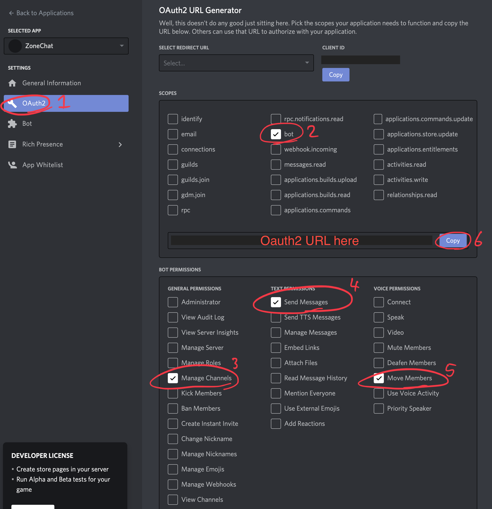
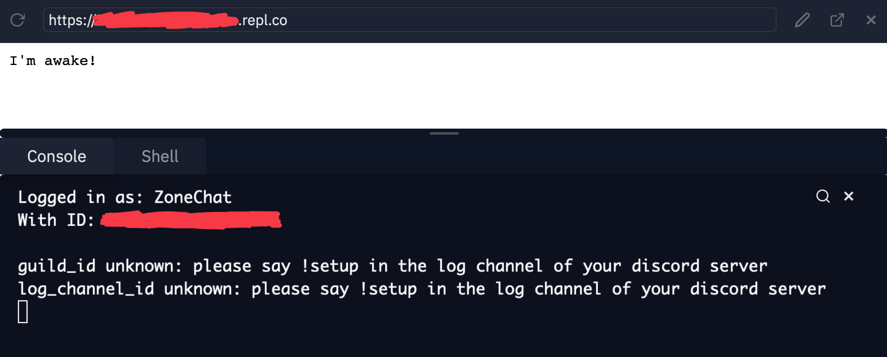
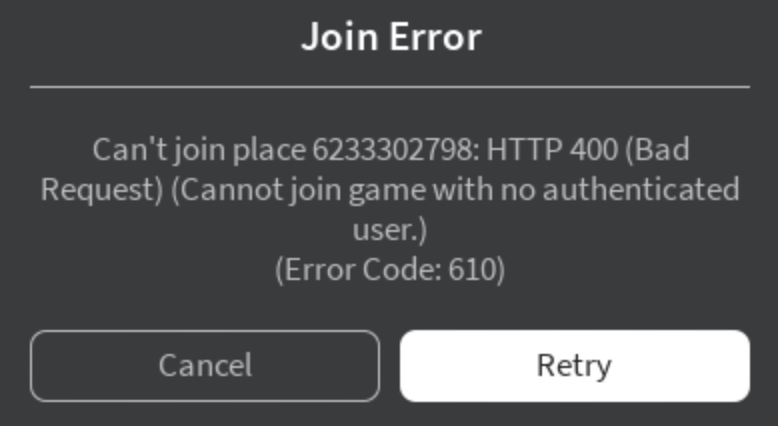
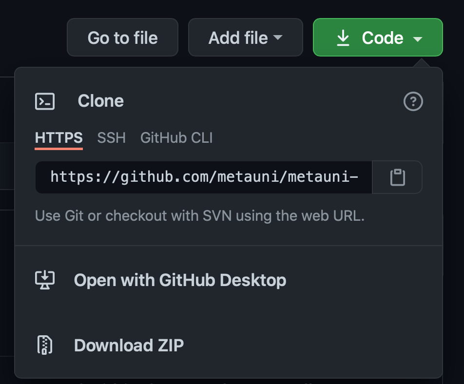
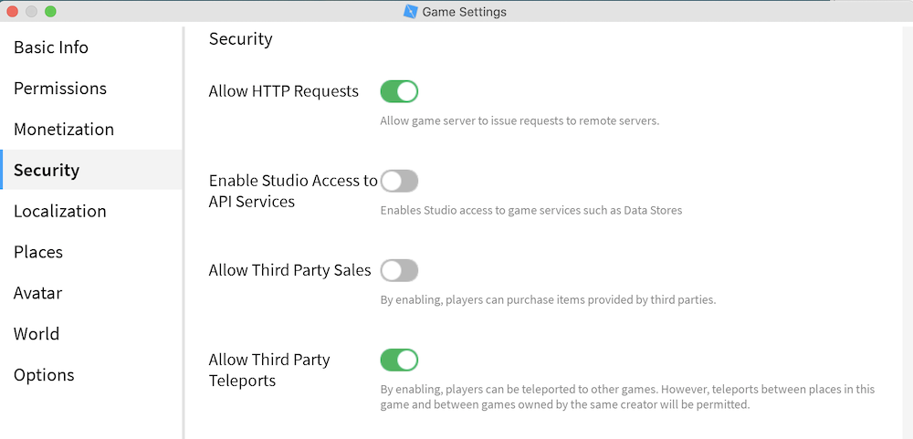
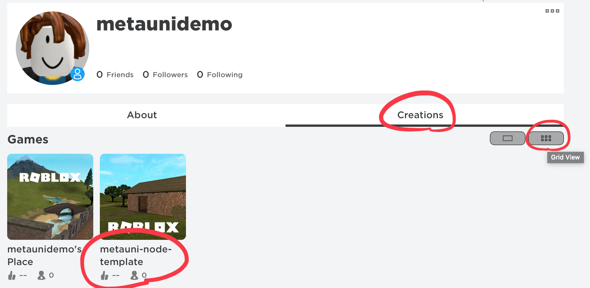

# How To Create Your Own metauni Node

Creating a metauni node is *free and easy*, requiring no coding experience (there are a few steps though). Before you post content to your node, please [review the Roblox platform rules](http://metauni.org/posts/rules/rules).

## Accounts
You will need to create the following accounts. Roblox and Discord are mandatory, but repl.it may be substituted with your preferred persistent server and database.
- [Roblox](https://www.roblox.com)
- [Discord](https://discord.com/) - for joining and hosting voice channels
- [repl.it](https://repl.it) - controls the discord bot and hosts the database
- [uptimerobot](https://uptimerobot.com) - pings the repl.it to keep it alive.

**Recommended**: _Open up a Notepad or TextEdit document to copy things down as we go_

## 1. Creating your Discord server
We will first make a Discord server for your Roblox world. Visitors to your Roblox world can join your Discord to talk to each other over a Discord voice channel. Note that Roblox has strict rules that you **cannot advertise Discord channels in-world** either on objects within the game or in the chat, to protect the millions of children on their platform. This means that you must put your Roblox and Discord information on your webpage, or in some other place outside the Metaverse.

1.1) **Download the [Discord](https://discord.com/) desktop app** if you haven't already, and create a new server with the (+) button.


1.2) **Create the ZoneChat discord bot**
Go to the Applications tab of the [Discord Developer Portal](https://discord.com/developers/applications). Select `New Application` in the top left and name your app, we'll call ours `ZoneChat`. Then go to the `Bot` tab and add a bot to your app. This new bot has a token/secret, which you should now copy and save for later use. 

- Keep this token private. If anyone knows this token they can control your bot and therefore your Discord server. If you think a token has been compromised you can regenerate a new one with the `Regenerate` button, rendering the old one useless.

 
 
 - On the same screen you need to enable `Server Members Intent`
 
 

1.3) **Add the bot to your Discord server**
Go to the `Oauth2 Generator` under the `Oauth2` tab of your `ZoneChat` app. Under `scope` select `bot`, and then enable the following permissions
- `Move Members` - to move users between zone voice-channels
- `Send Messages` - for logging
- `Manage Channels` - for creating new zone voice-channels as necessary

Then go to the generated Oauth2 URL and add the bot to your server.



If successful, you should see your Discord server has a new member.


1.4) **Add a private log channel to your server for the zone-chat bot**
Click the (+) to create a text channel under `TEXT CHANNELS`, and name it (we called this one `zonechatbot`). Make it a private channel and allow the bot to access it if you have the option. This is a channel for the bot to send any necessary log messages.


- If you don't have the private channel option or can't add the bot, click the edit channel gear and go to the `Permissions` tab. With the `@everyone` role selected, make sure `View Channel` is disabled.


Now click the (+) next to `ROLES/MEMBERS` and add the **role** of your bot, then allow it to `View Channel`.


## 2. repl.it - Making the bot backend

2.1) **Fork the ZoneChat repl.it**
Go to [repl.it/@BillyPrice/ZoneChat](https://repl.it/@BillyPrice/ZoneChat) and click `Fork` at the very top. Rename it and make it private if you want.
If this bot is updated in the future (check the date at the top of the main.py file) - you can simply copy and paste the main.py file into your repl.it and rerun `!setup`.

2.2) **Create a file called `.env` for your Discord Bot Token**
Copy and paste this line into the `.env` file, replacing `<token>` with your actual bot's token (from the `Bot` tab of the Discord developer page)
```
DISCORD_BOT_SECRET=<token>
```
On repl.it, files called `.env` are only visible to owners and invited collaborators to that project - even if it is set to public - so it is safe to store our token here.

2.3) **Run your repl.it**
Click the green `Run` button at the top of the page and pray everything works. It should install various package dependencies before printing "I'm awake!". The console below will print diagnostic information - so pay attention to it if you are having problems. You will need the repl.co URL that appears above the console for the next step.



2.4) **Set up UptimeRobot**
You can leave your bot running on repl.it without having the tab open, but it will eventually shutdown with no activity. To keep it awake, we use [UptimeRobot](https://uptimerobot.com), which sends a request to your bot's url every 30mins to keep it awake. Follow step 4 of [this guide from repl.it](https://repl.it/talk/learn/Hosting-discordpy-bots-with-replit/11008) to set up uptimerobot for your bot. The URL/IP field is your repl.co URL from the last step.

2.5) **Run the !setup command in the log channel**
Since bots are typically used amongst many discord servers simultaneously, they don't store a canonical server (also called a guild in the Discord API). To let it remember which server/guild and log channel to remember for its use, we can just run the command !setup in the intended log channel on our server (the private channel we made before). This only needs to be done once, but can be repeated later if you want to use a different channel, or if something breaks.

We've now setup all of the backend - it's time to create your Roblox world!

## 3. Roblox Studio
3.1) **Download Roblox** by clicking play on any Roblox game ([here's The Rising Sea](https://www.roblox.com/games/6224932973/The-Rising-Sea)) and **Roblox Studio** via the `Start Creating` button at [roblox.com/create](https://www.roblox.com/create).
  - Mac - Run the `.dmg` file and drag Roblox to `Applications`. It will install Roblox Studio when you open it.
  - Windows - ??

(You may see this error when joining a Roblox game. Just click retry until it works)



3.2) **Download the `metauni-node-template` from the [metauni-dev repository](https://github.com/metauni/metauni-dev) and open it in Roblox Studio**.
The repository page has README, which contains a breakdown of the important contents of the template file. You can clone or download a zip of the repository using the green `Code` button.



3.3) **Paste the Bot URL**
Open the `ZonesScript` under `ServerScriptService` and find the variable `BotURL` (should be the first line). Now paste your repl.co URL from earlier between the two quotes and save the file. This script sends HTTP requests to the specified URL when a player enters a zone.


3.4) **Publish your node**
Go to `File -> Game Settings` and click `Publish` when prompted. Name and describe your place as you please, ideally similar to your Discord server. Then click `Publish` again.

3.5) **Allow HTTP Requests and Third Party Teleports**
We need to give our script permission to send these requests. Go to `File -> Game Settings` and enable `Allow HTTP Requests`. While you're there enable `Allow Third Party Teleports` (otherwise teleporting from your world to the Metauni hub will not function). Then then click `Save` (navigating to another menu discards this change).



3.6) **Make your node public**
Go to `File -> Game Settings -> Permissions` and set it to public. Save your changes.
You can then find your node through your profile on [Roblox](https://www.roblox.com). Navigate to your profile, either by clicking your avatar on the home page or using the menu at the top left of any page


Then go to **creations** to find your published game. You will already have a default place called `<User>'s Place`, so click the grid view button to see the one you've just published.



## 4. Test it out!
Great, you are ready to design, test and share your metauni node! You don't actually have to publish your game to test it out - you can do this locally within RobloxStudio. Just go to the test tab and click `Play`.


For someone (e.g. you) to join your node and use voice chat, they need to join your Discord server (you can invite them by right clicking your server name) and register their Roblox user name. To do this, they go to any channel (you might want to make a dedicated channel for this) and send `!register <ROBLOXUSERNAME>`.


Now we can test it out. Before entering a zone, you must first manually join any voice channel in your Discord server, in order for the bot to find and move you. When your character enters a zone, an event is triggered to notify your bot running on repl.it. The repl.it bot reacts to this request and moves the associated Discord user to the voice channel for that zone. If no voice channel has the same name as the zone, the bot automatically creates a new voice channel for that zone in the `ZONES` category, and moves the user to it.


As you create more zones with different names in your Roblox world, you can simply walk into the zone to generate the corresponding voice channel in your Discord.

## 5. Next steps (optional)

So your Roblox node is up and running, and it is integrated with your Discord sever. Now what do you do?

 - **Add your Discord link**. The Roblox page for your node can optionally link directly to your Discord server. The official instructions are [here](https://en.help.roblox.com/hc/en-us/articles/360000910966-Social-Media-Links-for-Games). Navigate to your game (_not_ the places within it) in `Games` under `Create` and then click `Social Links` on the left. You do not need to include the word "Discord" in the Title field (and in any case the moderation may prevent you) as the link will appear with a large Discord icon. For the URL put a Discord invite link.

 - **Link from hub**. Find your game on Roblox.com as in step (3.6) above, and copy your place ID from the URL (for example, [The Rising Sea](https://www.roblox.com/games/6224932973/The-Rising-Sea) has place ID `6224932973`). Then email your place ID, preferred text label to <admin@metauni.org> and we'll link you from the [Metauni hub](https://www.roblox.com/games/6233302798/Metauni-Hub). Optionally you can also send a Discord invite link, and we'll put both your Roblox node and Discord links on the metauni frontpage (under `Node directory`).
 

 
Next you'll want to start populating your world with useful objects. You are encouraged to re-use some of the objects in the Rising Sea node, for which see the [metauni-dev](https://github.com/metauni/metauni-dev) GitHub repository and [this video instruction](https://youtu.be/rHaRz8J79S4).

## "I need help!"

Come chat with us in [The Rising Sea Discord](https://discord.gg/9yBaAxPSK8) if you run into any troubles setting up your bot and Roblox world. Some common problems:
