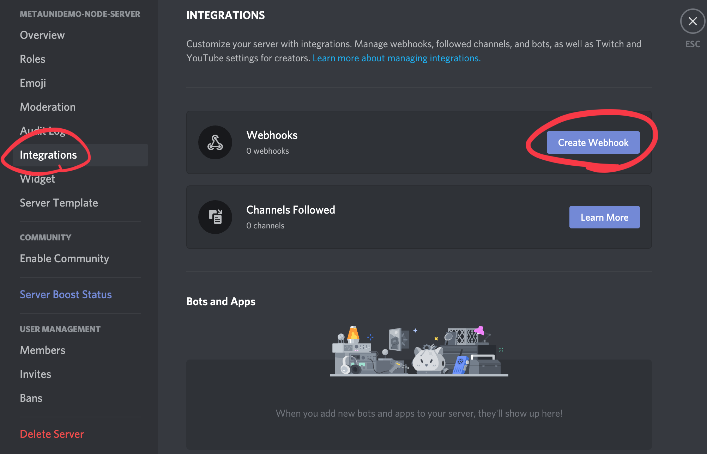

# How To Create Your Own metauni Node

## Accounts
You will need to create the following accounts. Roblox and Discord are mandatory for compatibility - but MongoDB and repl.it may be substituted for your preferred database and persistent server.
- [Roblox](https://www.roblox.com)
- [Discord](https://discord.com/) - for joining and hosting voice channels
- [MongoDB](https://www.mongodb.com) - stores Roblox and discord accounts for each user
- [repl.it](https://repl.it) - controls the discord bot and mongoDB for voice channels

## Assets
Download these for use throughout this guide
* [metauni-node-template](../metauni-node-template.rbxl)

## Roblox Studio
1. **Download Roblox** by clicking play on any Roblox game ([here's the metauni one](https://www.roblox.com/games/6233302798/Metauni)) and **Roblox Studio** via the `Start Creating` button at [roblox.com/create](https://www.roblox.com/create).
  - Mac - Run the `.dmg` file and drag Roblox to `Applications`. It will install Roblox Studio when you open it.
  - Windows - ??
(You may see this error when joining a Roblox game. Just click retry until it works)


2. **Open the [metauni-node-template](Backup18-1-2021.rbxl) in Roblox Studio** (double-click the `.rbxl` file).

### metauni-node-template contents

- Workspace -> **Spawn Location**: where players spawn into your place (move this down into the ground to make it invisible
- Workspace -> **Zones**: translucent zones which will correspond to voice channels within your discord channel
  - Each zone in this folder is a `Model` with a primary `Part` (the physical object), with `Transparency: 0.9` and `CanCollide` disabled so players can see and walk through it.
- Workspace -> metauniPortal: teleports players to the metauni hub.
  - This can be customised to teleport to any other place (i.e. another metauni node).
  - To make it teleport to [The Rising Sea](https://www.roblox.com/games/6224932973/The-Rising-Sea), take the number `6224932973` from the game url https://www.roblox.com/games/6224932973/The-Rising-Sea. Then double-click the `teleportScript` inside `metauniPortal` and modify the place ID in the line `local placeID_1 = 6233302798`.
- ServerScriptService -> **ZonesScript**: tells the discord bot which voice channel to move each player into, according to the current zone they are touching

3. **Publish your node**
Go to `File -> Game Settings` and click `Publish` when prompted. Name and describe your place as you please, ideally similar to your upcoming discord server. Then click `Publish` again.

4. **Allow HTTP Requests**
Go to `File -> Game Settings` and enable `Allow HTTP Requests`, then click `Save` (navigating to another menu discards this change). This is needed for the ZonesScript to communicate with the discord bot.

5. **Make your node public**
Go to `File -> Game Settings -> Permissions` and set it to public.
You can then find your node through your profile on [Roblox](https://www.roblox.com). Navigate to your profile, either by clicking your avatar on the home page or using the menu at the top left of any page 
Then go to **creations** to find your published game. You will already have a default place called `<User>'s Place`, so click the grid view button to see the one you just published.


Great, you are ready to design, test and share your metauni node! You don't actually have to publish your game to test it out - this can do this locally within the Roblox editor.

## Creating your Discord server

6. **Download the [Discord](https://discord.com/) desktop app** if you haven't already, and create a new server with the (+) button.

Fill in the details to your discretion, but choose a name similar or identical to the place you published on Roblox. Our's will be called `metaunidemo` for this guide.

7. **Add a private channel to your server for the zone-chat bot**
Click the (+) to create a text channel under `TEXT CHANNELS`, and name it (we called this one `zonechatbot`). 

You may or may not have the option to make it a private channel here. If not, click the gear next to your new channel, go to the `Permissions` tab and disable the `View Channel` option for @everyone. Save your changes.

8. **Add a webhook**
Go to your server settings (click your server name) and under `Integrations`, choose `Create Webhook`.


Name it whatever and assign it to the text channel you made for it. Then copy the webhook URL and save it somewhere for the next step (there will be a few things to copy).


9. **Create the ZoneChat discord bot**
Go to the Applications tab of the [Discord Developer Portal](https://discord.com/developers/applications). Select `New Application` in the top left and name your bot, we'll call ours `ZoneChat`. Then go to the `Bot` tab and add a bot to your app. This new bot has a token, which you should now copy and save along side your webhook URL for later use. 

10. **Add the bot to your discord server**
Go to the `Oauth2 Generator` under the `Oauth2` tab of your `ZoneChat` app. Under `scope` select `bot`, and then enable the permission `Send Messages`, `Read Message History` and `Move Members`. Then go to the generated Oauth2 URL and add the bot to your server. 
If successful, you should see your discord server has a new member. 

11. **Copy your Discord Author ID**
Go back to the discord desktop app to grab your author ID. You'll need to first enable developer mode under `Preferences -> Appearance`. 
Then open up the member list in your discord server (top right), right click on your profile and choose `Copy ID`. Save this alongside your discord webhook and discord bot token. 

## repl.it - Making and Hosting the bot backend

12. **Fork the MetaUni repl.it**
Go to [repl.it/@dmurfet/MetaUni](https://repl.it/@dmurfet/MetaUni) and click `Fork` at the very top.

13. **Create a `.env` file and add the following**

```
DISCORD_BOT_SECRET=#######
DISCORD_AUTHOR_ID=#######
DATABASE_PASSWORD=#######
```