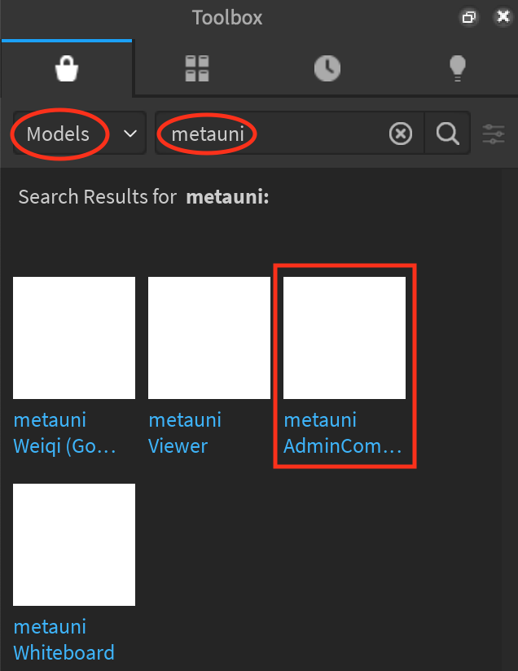
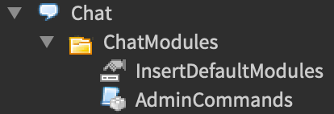

# Running a metauni node

After following the [guide](http://metauni.org/posts/make-your-own/make-your-own) to setup your own metauni node, the next question is: what do you do with it? On this page we explain how to reproduce the tools you see in our event videos for the Rising Sea node, and other aspects of enabling intellectual activities in a metauni node.

## metauni tools

We use the Rising Sea node and events therein to prototype useful objects, such as whiteboards and Weiqi boards, which are eventually released for free on the Roblox Toolbox for other people to use in their own nodes. To find them in Roblox Studio just open up the Toolbox and search for "metauni". The currently available objects:

* [metauni Weiqi board](https://www.roblox.com/library/6366028251/metauni-Weiqi-Go-board). This game board has a persistent state that survives across server restarts.
* [metauni Whiteboard](https://www.roblox.com/library/6376883627/metauni-Whiteboard). Multi-user whiteboard with undo. Use it with an iPad for extra joy.
* [metauni Viewer](https://www.roblox.com/library/6377010705/metauni-Viewer). Upload PNGs using Asset Manager, create Decals and put them in `Gui > Images` in order to put content into your world (e.g. papers).
* [metauni AdminCommands](https://www.roblox.com/library/6441205113/metauni-AdminCommands). Supports kick, ban and whiteboard management through the chat system, see below for details.

## Tips

* On the Roblox page for your game's main Place, click "..." and then `Configure this Place` then set `Access > Server Fill` to `Fill each server as full as possible`. Otherwise even with small numbers of players, they may spawn into completely separate copies of your world (keep in mind that the standard usage of Roblox is thousands of concurrent players split across many separate instances).

## Administration

Running a metauni node comes with responsibilities, since by running a Roblox world and Discord server you are in particular comitting yourself to the terms of service of Roblox and Discord. You should therefore familiarise yourself with the [Roblox rules](https://metauni.org/posts/rules/rules) and [Discord Terms of Service](https://discord.com/terms) at the risk of getting your account locked or banned. If you observe users breaking Roblox rules, for example harrassing other users or engaing in offensive behaviour, you should **report them using the Roblox tools** that can be accessed via `Escape`.

For less serious matters, you are invited to install and use the metauni administrative tools (see below). We encourage administrators of metauni nodes to be **particularly careful about the use of whiteboards** since some usages of these fall outside the Roblox rules (for example, the whiteboards should not be used as an alternative chat system, or used to post Discord links, URLs or offensive images, or in general to bypass the Roblox filtration system). You can use the metauni admin tools to turn whiteboards on or off, so that they are only enabled at particular times under the supervision of administrators or their delegates.

### Installing the admin tools

To facilitate administration, we have a ChatModule which extends the functionality of the in-game chat commands. Commands can be executed by chosen adminstrators by opening chat and entering the command. The module depends on a permission table stored in a persistent DataStore, which associates each Roblox user ID with a permission level (an integer), and is perserved between server restarts and even when updating your world.

|level|role|about|
|--|--|--|
|<0| banned|Instantly kicked when joining your world|
|0| guest | the default permission level|
|5| scribe|Can still draw when boards turned off|
|10| admin|Can execute all commands|

Each higher role in this hierchary accumulates any abilities of lower (non-negative) roles.

### Installing and using

To install AdminCommands, search for `metauni` in the toolbox and click on [metauni AdminCommands](https://www.roblox.com/library/6441205113/metauni-AdminCommands).

This will add a folder called `ChatModules` to your `Workspace`. Drag this folder to `Chat`, as below.

All done! This places our `AdminCommands` file amongst the other chat modules implemented by Roblox. `InsertDefaultModules` is a boolean flag that invites those modules to appear here on server start.

### Using commands

Enter your Roblox world to read about and try the commands. When an admin joins, they are reminded they can get a list of commands by chatting `/helpadmin` or command-specific help by adding a `?` after the command, e.g. `/ban?`

The creator of the Roblox world is hardcoded to have the highest permission level (infinity... duh). The usage of the commands themselves is all documented within Roblox chat itself, so here we will just give an overview.

### Banning
Ban management is achieved using the `/ban`, `/unban`, `/kick`, `/banstatus` commands. `/ban` lowers a players permission level to `-1`, kicks them from the game and rekicks them whenever they rejoin. This is a permanent ban that persists between server restarts and updates, and can be undone by `/unban`, which resets their permission level to `0` (unless they weren't banned). `/banstatus` can be used to check if someone is banned, and `/kick` can be used to kick them from the world temporarily (they can rejoin immediately).

### Whiteboard activation
Drawing on whiteboards can be disabled for guests with the `/boards off` command and reactivated with `/boards on`. This setting is preserved between server restarts and updates, so you may choose to leave the boards disabled when you're not around. This setting has no effect on *scribes* and *admins*, so you can assign the *scribe* role to, for example, guest speakers, or anyone you trust without giving them the admin role.

### Roles
Managing roles/permission levels is done via the `/setadmin`, `/setscribe`, `/setguest`, `/setperm`, `/getperm` commands. Chat `/setperm?` or `/getperm?` for a list of roles/permission levels.

### UPDATES
As this module is updated, the [metauni AdminCommands](https://www.roblox.com/library/6441205113/metauni-AdminCommands) model in the toolbox will be updated, so you can simply repeat the installation to get the new version.
