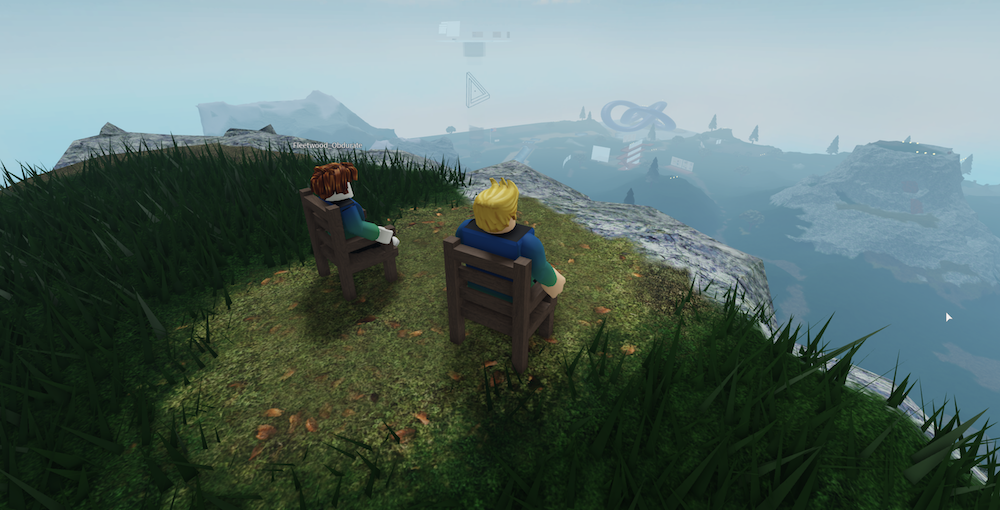

# The Rising Sea node

This node (TRS for short) is a collaboration between [Daniel Murfet](http://therisingsea.org/), Ziling Ye and [Lucas Cantor](https://www.lucascantormusic.com/). On this page you will find some eye candy and some comments on our experience running events in this node that might be helpful for others starting to investigate metauni and how it can be used for adventures in the configuration space of intellectual endeavours. This is also a place to cite some influences: Grothendieck (innocence, play and [all that](https://kongliang.wordpress.com/2010/02/27/hello-world/)), [Gwern](https://www.gwern.net/index), [Jonathan Blow](https://www.youtube.com/watch?v=qWFScmtiC44).

## Eye candy

The Knot (note how the shadows give a 2D projection, with shadow darkness serving as a marker of over and under-crossings):

Office hours at the peak of the Island:

## Remarks

Here are some of DM's thoughts, in no particular order:

* The potential for beauty in virtual spaces, especially using a combination of visuals, interaction design, music and art, is much undervalued. In my view, a metauni node should aim to synthesise this kind of beauty with a sense of play and an unapologetic commitment (i.e. no patronising or "dumbing down") to serious and difficult intellectual activity. That is the ideal we are trying to model with TRS.

* In Event 2 (the Build Your Own Node event, [video1](https://youtu.be/TDmMeR6O350), [video2](https://youtu.be/W0SIAygiITs)) we spent hours helping people get through the [instructions](http://metauni.org/posts/make-your-own/make-your-own). If this had been done on Zoom I'm quite certain the ambient spirit would have been bitter frustration, but my sense was that people were having a good time even when they were stuck due to the sense of fun and play that pervades a well-designed virtual world (people would take breaks from following the instructions to try knock over signposts and kick them down into the Well of Past Events, for instance).

* metauni on an iPad is pretty great. You can run both Roblox and Discord on the device, and the former runs well since recent iPad hardware has very good performance in 3D games. Moreover if you have an Apple Pencil you can use it on the in-world whiteboards, and although it is a bit laggy it is definitely usable for short mathematical conversations (and maybe lectures, I haven't tried).

* Discord is a functional replacement for Zoom with respect to sharing screens, but just like the free version of Zoom has certain limitations, so does the free tier of Discord. If you upgrade your server you can unlock higher resolution screen sharing (the free version is OK but you find it unusable depending on what you are doing) and higher audio quality. It's possible to mirror an iPad to a Mac and then screenshare, but it is probably better to just use in-world whiteboards which are already quite functional with an iPad.
